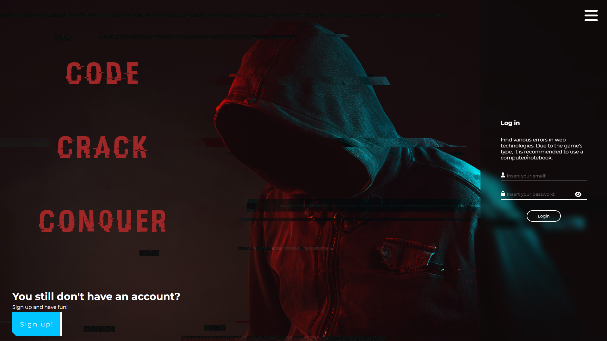
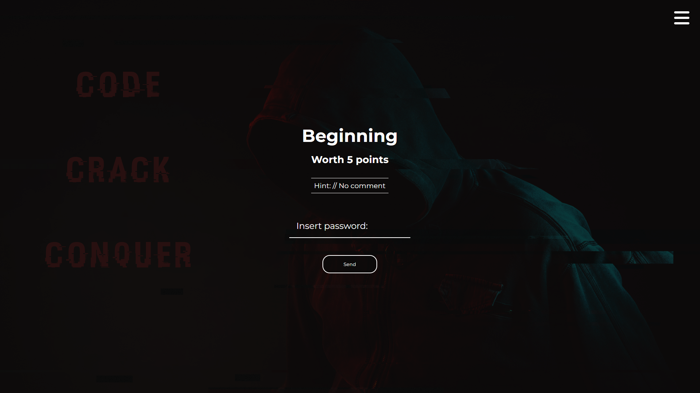
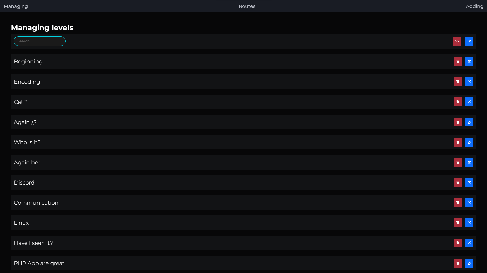

# Catch The Flag

This project is CTF (catch the flag) game made as dynamic webpage using **M**(mysql)**E**(express)**R**(react)**N**(nodejs) stack. The game has a focus on working with web technologies, social networks, encryption, forensics and malware analysis. Its mission is to raise awareness of these technologies and their dangers The project is inspired by HackTheBox, TryHackMe and other CTF games.
#

# Preview

## Index Page


#

## Level Template Page


#

## AdminMenu Level Moderation Page


#

## Responsive design


#

# How to start the application ( DEVELOPMENT VERSION )
* Open 2 terminals


* In first terminal go into **frontend** folder
```
cd main_app/frontend/
```
* Download dependencies for react
```
npm i
```
* Start react development server with
```
npm start
```
* In second terminal go into **backend** folder
```
cd main_app/backend/
```
* Create there **.env** file 
```
PORT=8080


HOST=localhost
DEV=root
PASSWORD=
DATABASE=catch_the_flag_game


EMAIL_ADDRESS=your@email.com
EMAIL_PASSWORD=yourEmailPa$$w0rd


SESSION_SECRET=long_string_of_random_characters
```
* Download dependencies for Express
```
npm i
```

# How to host the application ( HOSTING )
* Open 2 terminals


* In first terminal go into **frontend** folder
```
cd main_app/frontend/
```
* Download dependencies for react
```
npm i
```
* Build React files into static
```
npm run build
```
* Transfer everything from build to your web hosting
* In second terminal go into **backend** folder
```
cd main_app/backend/
```
* Create there **.env** file 
```
PORT=8080


HOST=database_server_domain
DEV=database_administrator
PASSWORD=database_administrator_password
DATABASE=catch_the_flag_game


EMAIL_ADDRESS=your@email.com
EMAIL_PASSWORD=yourEmailPa$$w0rd


SESSION_SECRET=long_string_of_random_characters
```
* Download dependencies for Express
```
npm i
```
* Run the Express server
```
node app.js
```

#
#
#

## Happy hacking
